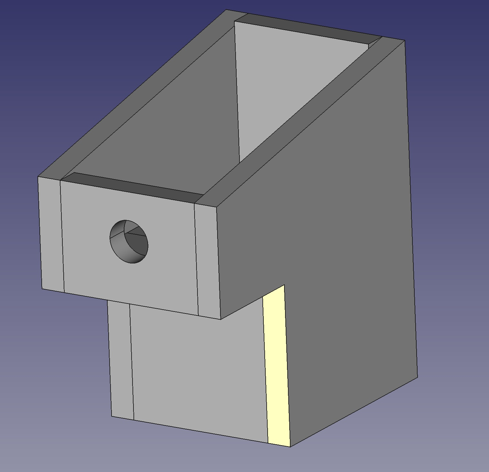

Ce projet contient les plans d'un nichoir. 

Chaque pièce a été modélisée séparément sous FreeCad puis assemblées au moyen du module Assembly2. Le projet complet peut donc être visualisé via nichoir_1.FCStd. 

Note : le toit n'a pas été ajouté à l'ensemble. 

TODO : générer les vues orthogonales (via l'atelier Drawing) puis les retravailler sous Inkscape afin de produire des plans au format DXF.